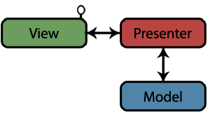
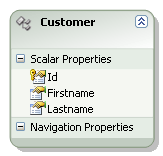
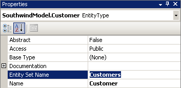
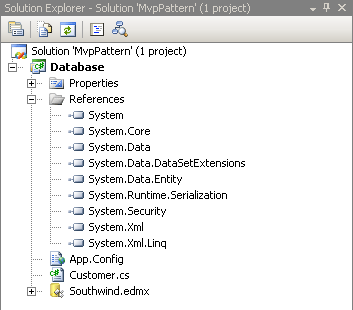
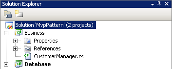
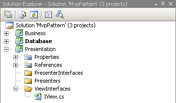
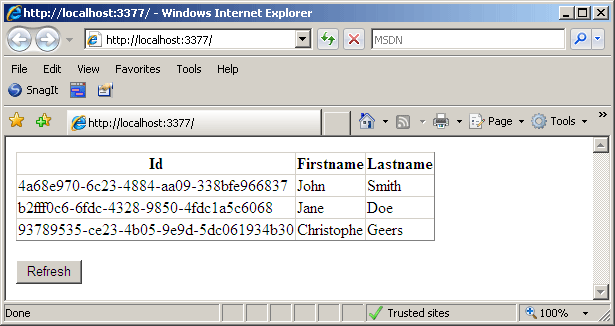
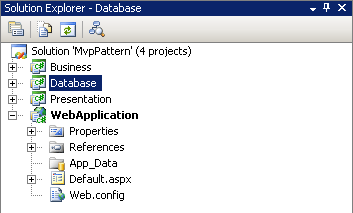
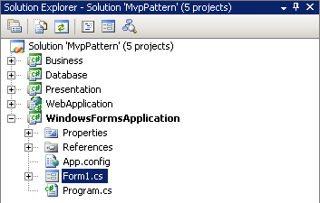

# MVP: Model View Presenter

## Introduction

Last week I was reading some articles about using WCF, the Entity Framework and how to transport entities across the service boundary. One of the articles I encountered included a demo project that made use of the Model View Presenter (MVP) pattern.

Having explored the demo project I thought it might be interesting to write an article about this pattern. Your favorite search engine will happily supply you with a plethora of links to other articles that explain this pattern thoroughly.

For this article I've decided to supply a concrete implemention and to focus less on the theory behind the pattern.

Let's roll...

## The Pattern

Of course a bit of theory is required, so let's get it out of the way.

As you can deduct from the name the MVP pattern consists out of three distinct parts: the Model, View and Presenter. Each of these parts play their own role in establishing a separation of concerns between the presentation, business and data access layer.

The Model is responsible for handling the data access, the Presenter communicates with the Model and passes data from and to it. The View receives data from the Presenter and passes data back, it never communicates directly with the Model. The Presenter is the go-between for the View and Model.

**Figure 1** - MVP Pattern Interaction



The image above depicts the View as implementing an interface. The presentation layer be it an ASP.NET, WinForms or WPF applications needs to implement one or more view interfaces. The Presenter in turn communicates with the View implementation through this interface, it knows nothing about the actual implementation itself.

This provides a loose coupling and prevents your code from being dependant on the technology used for the Presentation Layer. The idea is that you should be able to replace this layer without it affecting your business and data access logic.

This might all seem a little vague, but things should clear up once we move on to the following points which provide an actual implementation of this pattern. For the example an ASP.NET application will be used.

## Model

The most logical place to start with is the Model. Since it is responsible for handling data access and storage we first need to establish a physical data store. For this I used SQL Server 2005 Express, created a new database called Southwind and added one table titled Customer. The table has 3 fields, namely:

- **Id**: Unique identifier (GUID) & Primary key
- **Firstname**: nvarchar(50)
- **Lastname**: nvarchar(50)

That's it for the database. Let's fire up Visual Studio 2008 and create a new blank solution named AvpPattern. Next add a class library titled "Database".

Normally I'd give the project a name that follows the pattern "Company.Product.Library", but for simplicity's sake let's keep it short and simple. Also delete the autogenerated class1.cs file after the project has been added to the solution.

Let's create a model from the database using the Entity Framework (EF). So be sure you are using Visual Studio 2008 and have Service Pack 1 installed for Visual Studio and the .NET Framework 3.5. You can download the service packs [here](http://msdn.microsoft.com/en-us/vstudio/cc533448.aspx).

Add a Entity Framework data model to the class library by selecting Add, New Item, ADO.NET Entity Data Model from the project's context menu in the Solution Explorer. Visual Studio will now show the Entity Data Model Wizard. Name the model Southwind and let Visual Studio generate the model for you. When asked which database objects you want to include in your model just select the Customer table from the tables node.

**Remark**: If you are not familiar with generating data models with the Entity Framework I highly suggest this [training video](http://www.asp.net/learn/3.5-videos/video-300.aspx) from Alex James. It shows you how to build a simple Entity Data Model from scratch.

Figure 2 shows the resulting entity data model. The model can't get much simpler than this. This is done on purpose to keep things as simple as possible and to keep the focus on the MVP pattern.

**Figure 2** - Entity Data Model



Be sure to rename your EntityTypes and EntitySets to an appropriate name after the data model has been generated. The rule of thumb is to use a single noun for the EntityType and a plural for the EntitySets. So in this case our EntityType should be named Customer and the EntitySet Customers. The name for the EntityType is already ok as it inherits it from the Customer table, so just select the Customer EntityType and adjust its Entity Set Name property.

**Figure 3** - Entity Set Name



The Entity Framework will automatically generate a partial class for the Customer table. You can choose to extend this partical Customer class if you want to. To prevent your custom additions from being erased when regenerating the model put this code in a separate class file. This is simular to working with strongly typed datasets. For the article this is not required however.

**Figure 4** - Solution Explorer



## Business Layer

Now that the model is in place let's add a business layer on top of it where we can define our custom business logic. For simplicity's sake I will keep the amount of code limited in this layer.

Note that these layers only enforce a logical separation (n-layer), not a physical one (n-tier). The layers all reside on the same machine, though you could certainly choose to disbribute them across multiple machines / tiers and create a truly distributed or n-tier application.

To setup the Business Layer add a new class library to the solution and call it Business. Next rename the default Class.cs file to CustomerManager.cs. Also add references to the previously created class library Database and to the System.Data.Entity assembly.

Listing 1 displays the CustomerManager class which contains some business logic for working with the Customer entity from the Entity Data Model (EDM). The code is pretty much self-explanatory.

**Listing 1** - CustomerManager class

```csharp
using System.Collections.Generic;
using System.Linq;
using Database;

namespace Business
{
    public class CustomerManager
    {
        private readonly SouthwindEntities context;

        #region Constructor(s)

        public CustomerManager()
        {
            context = new SouthwindEntities();
        }

        #endregion

        #region Methods

        // Retrieve a generic list of Customer entities.
        // This method will return all the customers found in the Customer table.
        public List<Customer> GetCustomers()
        {
            var q = from c in context.Customers
                    select c;
            return q.ToList();
        }

        #endregion
    }
}
```

**Figure 5** - Updated Solution



**Remark**: Setting up an n-tier application would include introducing a Service Layer which the Presentation Layer calls into. The Service Layer then utilizes the business objects found in the Business Layer. There is no direct association between the Presentation and Business Layer anymore, the Service Layer acts as an intermediate. In a future article I will address this by showing how to transport EF Entities across the service boundary.

## View

The Business Layer only contains one useful method, namely "List<Customer> GetCustomers()". The Presenter in the MVP pattern will call this method on the CustomerManager business object in order to deliver the data to the view.

The example application only shows a list of customers using the MVP pattern. This might be a bit of overkill, but it's kept as simple as possibly by design. The main goal of this "Hello World!" type of application is to get the idea across of how to implement this pattern. The actual functionality offered by the application is not that important.

The actual view implementation (ASPX page, WinForms, WPF...etc.) will need to implement a view interface. The view implementation needs to create an instance of the Presenter and pass itself as a parameter in its constructor. The Presenter's constructor has one parameter which is the type of the view interface.

Listing 2 lists the IView interface which we will implement shortly in an ASP.NET ASPX page. It has one event named PrepareView. The PrepareView event uses a delegate whose signature specifies that it returns nothing and takes no parameters.

The View should only raise these kind of "empty events" as to signify to the Presenter that some action should be performed. The action in this case signifies that the Presenter should refresh the list of Customers that the view implementation maintains. The Presenter can access this list of customers through the IList<Customer> Customers property which is declared as part of the interface.

**Listing 2** - View Interface

```csharp
public delegate void VoidEventHandler();

public interface IView
{
    event VoidEventHandler PrepareView;
    IList<Customer> Customers { set; }
}
```

To add the view interface to your project first add a new class library project to the solution called Presentation. Next add a new interface and copy and paste the code shown in the above listing. The Presentation code library will also contain the Presenters and the interfaces they implement.

I separate the view interfaces and presenters in a separate code library so that you can easily share them between multiple "view frameworks" such as ASP.NET, WinForms, WPF...etc. Figure 6 shows how I've chosen to organise this code library.

**Figure 6** - Updated Solution



Don't forget to add references to the Database and Business projects and the System.Data.Entity assembly.

## Presenter

For the final part of the MVP pattern we need to provide a Presenter. The CustomersPresenter class shown in Listing 3 takes a reference to an IView implementation in its constructor. This way it can communicate with the view without actually knowing anything about the actual implementation. It is this loose coupling that makes the MVP pattern so suitable for different "view frameworks".

Also in the constructor all the events of the view interface are hooked up to an event handler. In this case there is only one event. The PrepareView event is hooked up to the view_PrepareView event handler. This in turn calls the Presenter's private method GetCustomers() which returns a "refreshed" Customers collection and assigns it to the Customers collection maintained by the view implementation.

**Listing 3** - CustomersPresenter class

```csharp
public class CustomersPresenter : ICustomersPresenter
{
    #region Fields

    private readonly IView view;

    #endregion

    #region Constructor(s)

    public CustomersPresenter(IView view)
    {
        // Save a reference to the view
        this.view = view;

        // Hook up an event handler for the events of the view
        view.PrepareView += view_PrepareView;
    }

    #endregion

    #region Private methods

    private List<Customer> GetCustomers()
    {
        return new CustomerManager().GetCustomers();
    }

    #endregion

    #region ICustomersPresenter Members

    public virtual void view_PrepareView()
    {
        view.Customers = GetCustomers();
    }

    #endregion
}
```

The above Presenter also implements an interface. In the sample source code this interface is left empty. I've only put it there for illustrative purposes. You can flesh out this interface if you desire. You might need it for your favorite unit testing framework to mock presenters for example.

## ASP.NET User Interface

So the view or ASPX page in our case only needs to implement the view interface and trigger the PrepareView event in order to receive an updated customers list from the Presenter. The view itself does not communicate with the database or Business Layer directly. The Presenter handles the communication with the Business Layer which retrieves the data by addressing the Model (or Data Access Layer if you will).

To finish up this article let's see how this all comes together in an ASP.NET demo project. Add a new project using the ASP.NET Web Application project template to the solution. Add references to the Presentation and Database projects and the System.Data.Entity assembly.

Add a GridView named "GridView1" and a Button named "btnRefresh" to the Default.aspx page. Add the code in Listing 4 to the code behind of the page.

**Listing 4** - Default.aspx Code Behind

```csharp
public partial class _Default : System.Web.UI.Page, IView
{
    private CustomersPresenter presenter;

    protected override void OnInit(EventArgs e)
    {
        presenter = new CustomersPresenter(this);
    }

    protected void Page_Load(object sender, EventArgs e)
    {
        if (!IsPostBack)
        {
            PrepareView();
        }
    }

    protected void btnRefresh_Click(object sender, EventArgs e)
    {
        PrepareView();
    }

    #region IView Members

    public event VoidEventHandler PrepareView;

    public IList<Database.Customer> Customers
    {
        set
        {
            GridView1.DataSource = value;
            GridView1.DataBind();
        }
    }

    #endregion
}
```

All the code behind of the ASPX page does is implement the IView interface, create a Presenter and pass an IView implementation, being itself, into its constructor. Then all that remains is to trigger the PrepareView() event of the IView interface at the appropriate times.

During the creation of the Presenter an event handler is automatically assigned to this event which makes sure that when it is triggered the Presenter knows how to update the Customers collection maintained by the page. The page itself knows nothing of where this data is coming from or how it is retrieved. The dumber a view the better.

When viewing this page in a browser this is the result:

**Figure 7** - ASP.NET Website Demo



**Remark**: Don't forget to add the connectionstring required by the Entity Framework to the web.config configuration file. You can find the connectionstring in the App.config file of the Database class library project. It was inserted there automatically when Visual Studio generated the Entity Data Model.

Of course the connection strings in supplied in the sample source code won't work on your computer as they were constructed against a local database of mine. So be sure to adjust them accordingly.

**Figure 8** - Updated Solution



## WinForms User Interface

As the final step of this article let's create a view using a Windows Forms application just to show you how flexible the MVP pattern really is. The steps to do this are nearly identical to the previous example of creating an ASP.NET website. Add a new Windows Forms application to your solution and add references to the Database and Presentation project and the System.Data.Entity assembly.

Next add a DataGridView and Button control to the form. The code for the form is displayed in the listing below. It is almost identical to that of the Default.aspx page. Also don't forget to add the Entity Framework connection string to the App.config configuration file.

**Listing 5** - Form1.cs code

```csharp
using System;
using System.Windows.Forms;
using Presentation.Presenters;
using Presentation.ViewInterfaces;

namespace WindowsFormsApplication
{
    public partial class Form1 : Form, IView
    {
        private CustomersPresenter presenter;

        public Form1()
        {
            InitializeComponent();

            presenter = new CustomersPresenter(this);
        }

        private void Form1_Load(object sender, EventArgs e)
        {
            PrepareView();
        }

        private void btnRefresh_Click(object sender, EventArgs e)
        {
            PrepareView();
        }

        #region IView Members

        public event VoidEventHandler PrepareView;

        public System.Collections.Generic.IList<Database.Customer> Customers
        {
            set
            {
                dataGridView1.DataSource = value;
            }
        }

        #endregion
    }
}
```

Voila, we're finally done. Note that although the ASP.NET and WinForms example are almost identical in code this might not be the case in more complex applications. The types of interactions in these two types of user interfaces are vastly different and coming up with a presenter you can use in all situations might not be that clear cut.

**Figure 9** - Windows Forms Application Demo


**Figure 10** - Updated Solution



## Summary

For this article the classic interpretation of the MVP pattern was used and demonstrated by implementing it an ASP.NET solution. The original MVP pattern is deemed "[retired](http://martinfowler.com/eaaDev/ModelViewPresenter.html)" ever since Martin Fowler announced so. The pattern can be split into two camps now, being:

- Passive View
- Supervising Controller

Read this Microsoft Patterns & Practices [article](http://msdn.microsoft.com/en-us/library/cc304760.aspx) for more information.

I wrote this article to supply a concrete implementation of the MVP pattern as I was exploring it at the time. However it might be wise to stay clear of it and wait until Microsoft releases the ASP.NET MVC framework. For those wishing to mimic an Model-View-Controller (MVC) framework now I suggest reading [this article](http://msdn.microsoft.com/en-us/library/ms998540.aspx) by Microsoft Patterns & Practices.

**Remark**: The MVP pattern is a derivative of the Model View Controller pattern (MVC). At the time of this writing Microsoft is currently busy developing the [ASP.NET MVC Framework](http://www.asp.net/mvc). When mapping out the architecture for a new website project I suggest checking out this framework.

The main difference between the MVP and MVC patterns can be pinpointed to who is responsible for handling the user input such as keyboard and moue events. In the MVP pattern the GUI itself is responsible and needs to delegate them to the Presenter through events. In the MVC pattern the controller is responsible for handling these events.
